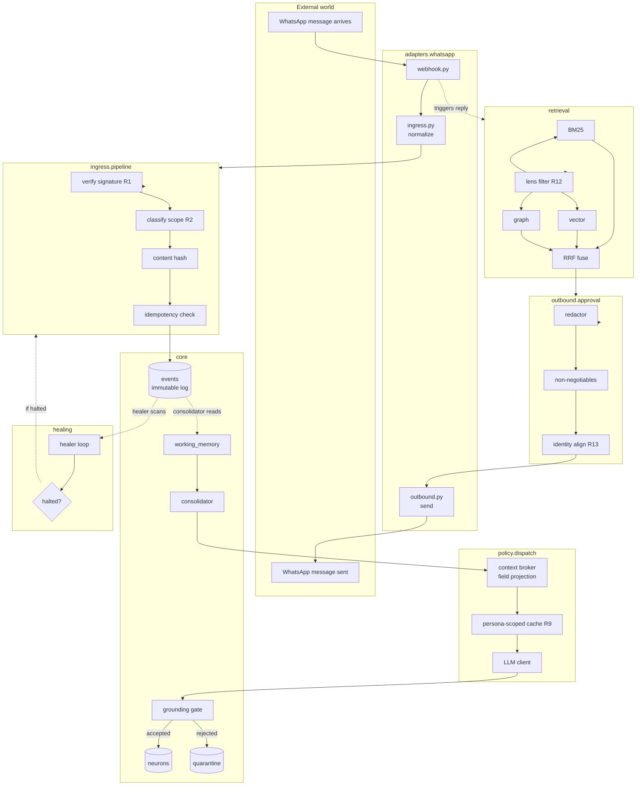
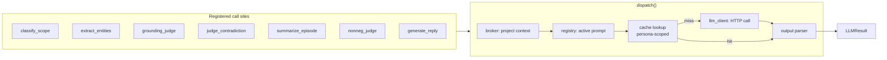
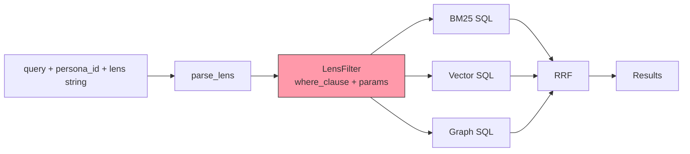
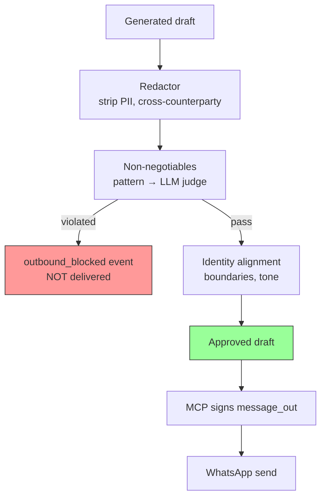
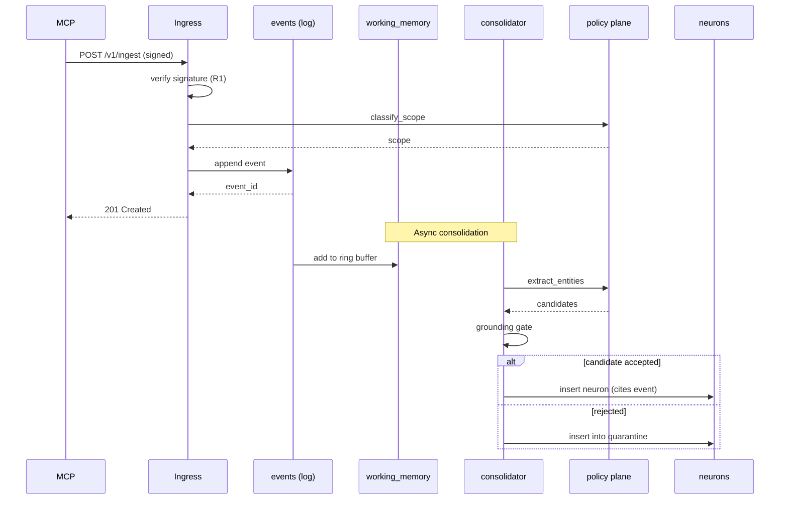

# Architecture Diagrams

> ASCII / Mermaid diagrams that render inline. For export artifacts (SVG, PNG) check `docs/diagrams/exports/` (populated during Phase 6).

## System overview



## The policy plane



## Lens enforcement (rule 12)



The red `LensFilter` node is load-bearing: every stream must apply it. There is no code path that runs an unfiltered query on `neurons`.

## Outbound pipeline



## Event → neuron lifecycle



## File sources

These diagrams are Mermaid source embedded in Markdown. They render on GitHub, in most Markdown viewers, and can be exported to SVG/PNG via `mmdc` (mermaid-cli):

```bash
npx -p @mermaid-js/mermaid-cli mmdc -i docs/diagrams/README.md -o docs/diagrams/exports/
```

Phase 6 adds an optional CI step that exports SVGs on every diagram change, committing them to `docs/diagrams/exports/`.
